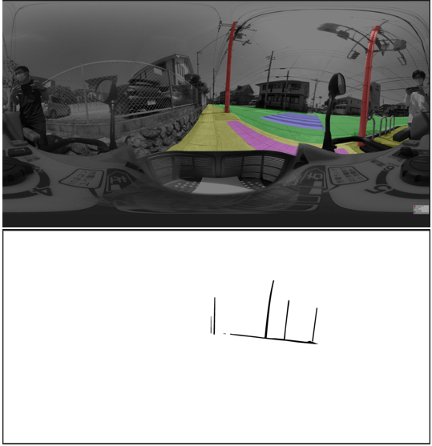
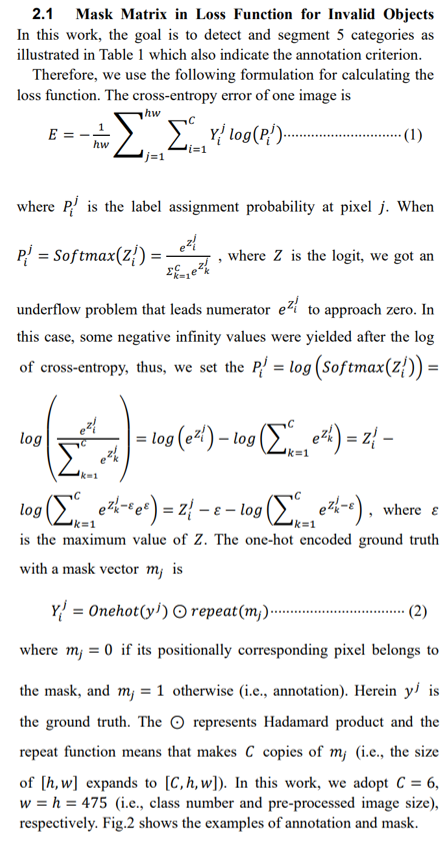
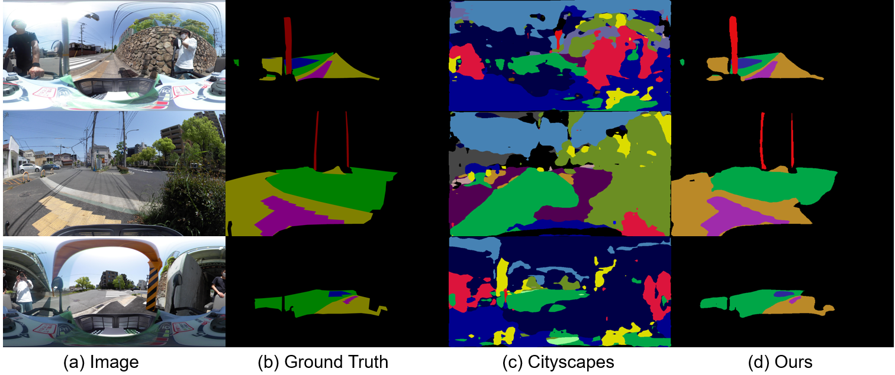
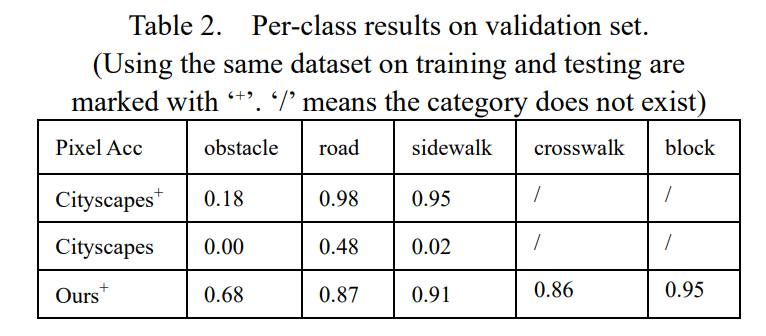

# SemanticSegmentationViaOmnidirectionalCamera
This paper [Semantic Segmentation for Street Scene Perception via a Mobility Scooter Mounted Omnidirectional Camera](https://www.bookpark.ne.jp/cm/ieej/detail/IEEJ-BTC2022SS03003-PDF/) has been accpeted by IEEJ 2022 Annual Conference on Electronics, Information and Systems (IEEJ-EISS 2022). ([Outstanding Student Presentation Award](https://www.konan-u.ac.jp/news/archives/38840))

### Citation
```
B. Zhang and M. Tanaka, "Semantic Segmentation for Street Scene Perception via a Mobility Scooter Mounted Omnidirectional Camera," Proceedings of IEEJ 2022 Annual Conference on Electronics, Information and Systems (IEEJ-EISS 2022), Student Competition Session, pp.1593-1594, 2022.
```

In this work, we aim to deal with road segmentation and obstacle detection tasks in semantic segmentation for the street scene via the mobility-scooter-mounted omnidirectional camera.

There is a problem of misrecognition caused by the recognition labels entering the background label. Furthermore, semantic segmentation cannot distinguish an object and others which are the same category.



To tackle this problem, a 0-1 matrix masks is adopted in cross-entropy loss in order to reduce the redundant information. 



Finally, we conduct the experiment on our method based on the created dataset to compare with Cityscapes.






# Usage
### Dependencies 
```
python=3.9
pytorch 
torchvision 
cudatoolkit=11.3
ipykernel
numpy
Pillow
matplotlib
pandas
opencv-python
tqdm
imgviz==0.12.1
labelme==4.5.7
```

### Model
We fine-tuned the following models by using the pre-trained weights on [ADE20K dataset (pspnet50_ADE20K.pth)](https://drive.google.com/open?id=12eN6SpnawYuQmD1k9VgVW3QSgPR6hICc).
```
DeepLabv3
PSPNet
UNet
```

### Datasets
[Cityscapes Dataset](https://www.cityscapes-dataset.com/)


### Train, validation, and evaluation
```
Training_DeepLabv3_Cityscapes.py
Training_DeepLabv3.py
Training_PSPNet_Cityscapes.py
Training_PSPNet.py
Training_UNet.py
```

### Inference
```
Inference_DeepLabv3.py
Inference_PSPNet_Cityscapes.py
Inference_PSPNet.py
Inference_UNet.py
```


